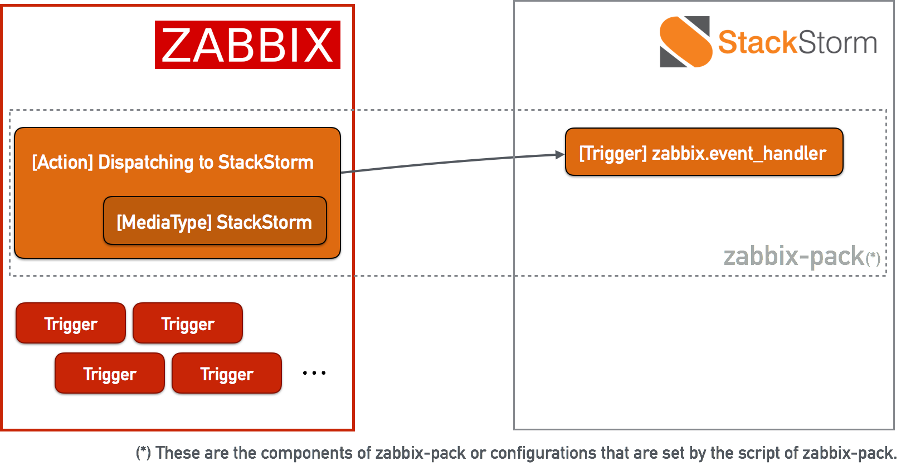
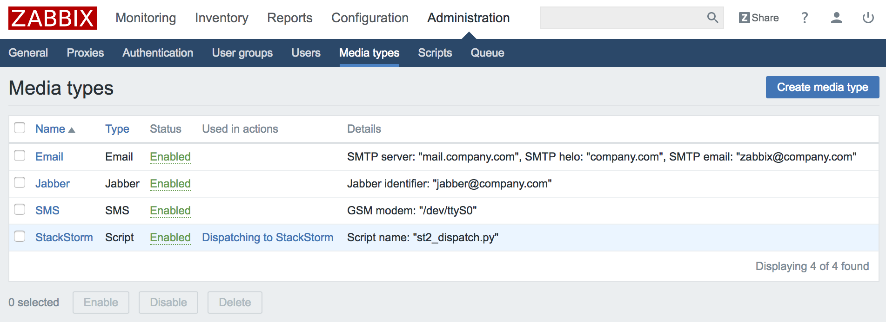
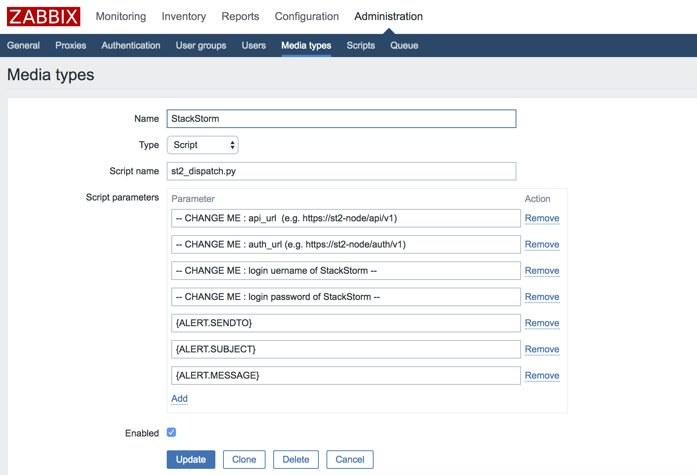
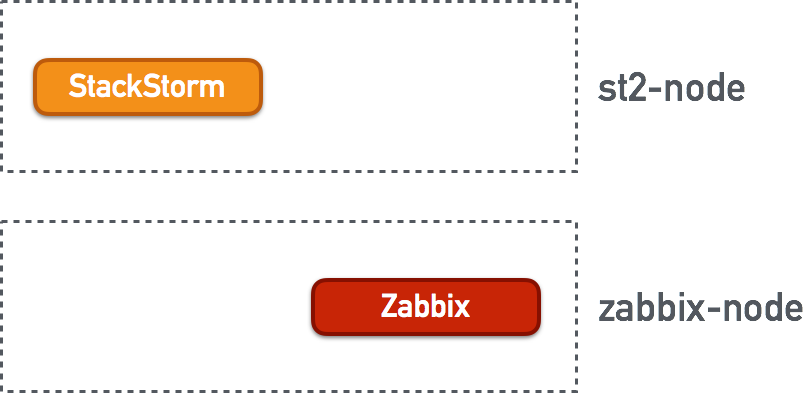
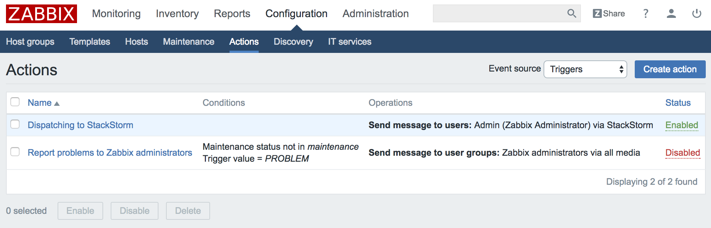
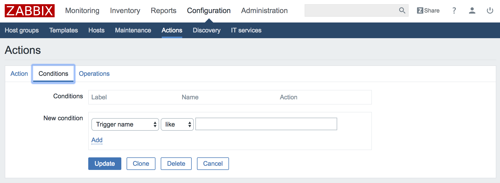
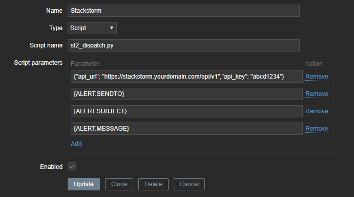
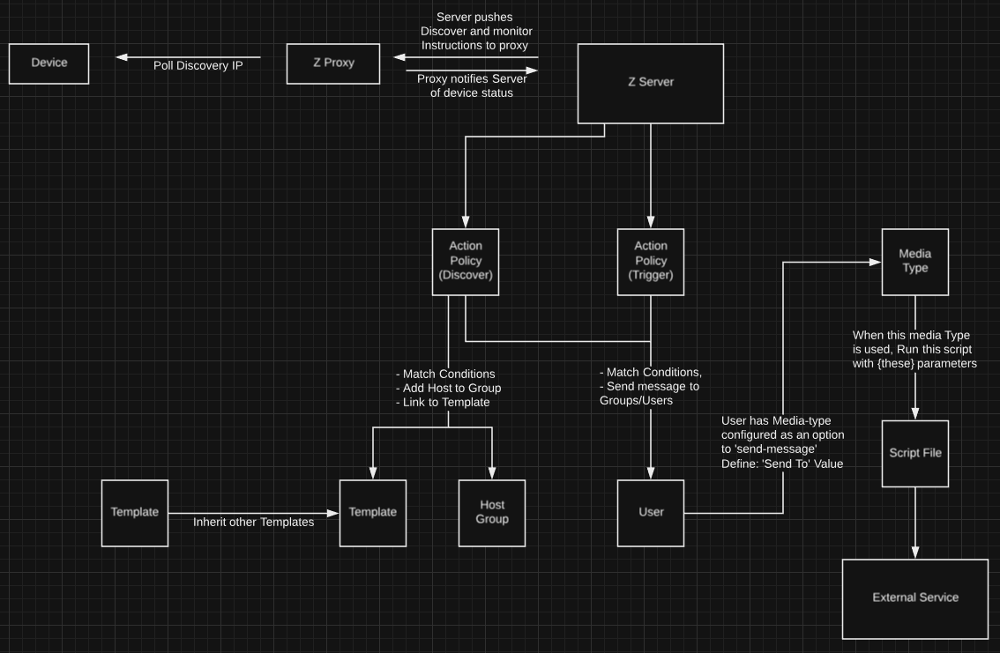

# Zabbix Integration Pack
This pack provides capabilities for working with Zabbix - both receiving events and responding to them, and actions for querying Zabbix, managing hosts and maintenance, etc. This pack configures Zabbix to dispatch event to the Trigger `zabbix.event_handler` when Zabbix raises an alert.

This README explains how this integration works, and how to configure it.



# Requirements

* Zabbix >3.0. It has been tested with v3.0, v3.2 and v4.0.

# Installation
Install the pack:

```shell
$ st2 pack install zabbix
```

Configure Zabbix to dispatch the "zabbix.event_handler" trigger, using the `/opt/stackstorm/packs/zabbix/tools/register_st2_config_to_zabbix.py` command. 

Usage:

```shell
Usage: register_st2_config_to_zabbix.py [options]

Options:
  -h, --help            show this help message and exit
  -z Z_URL, --zabbix-url=Z_URL
                        The URL of Zabbix Server
  -u Z_USERID, --username=Z_USERID
                        Login username to login Zabbix Server
  -p Z_PASSWD, --password=Z_PASSWD
                        Password which is associated with the username
  -s Z_SENDTO, --sendto=Z_SENDTO
                        Address, user name or other identifier of the
                        recipient
```

Example execution:

```shell
$ /opt/stackstorm/virtualenvs/zabbix/bin/python /opt/stackstorm/packs/zabbix/tools/register_st2_config_to_zabbix.py -z http://zabbix-host/zabbix -u Admin -p zabbix
```

NOTE: It's important you use ``python`` binary from the pack virtual environment (``/opt/stackstorm/virtualenvs/zabbix/bin/python``)
and not the system one. If you use system Python binary you will see error similar to ``ImportError: No module named zabbix.api``.

This will register a new MediaType (`StackStorm`) to dispatch events and add an associated action (`Dispatching to StackStorm`).

When you create a new Zabbix-Trigger and link it to the Action, StackStorm will accept the message from Zabbix.

## Zabbix configuration

### MediaType for the StackStorm
After executing the `register_st2_config_to_zabbix.py` command, you can notice that new MediaType `StackStorm` is added on `Media types` page (go to `Administration` > `MediaType`). You also have to this configuration to send a request for dispatching trigger to StackStorm when Zabbix server detect an alert. Please click the `StackStorm` mediatype.


You see following page, and you have to fill out with parameters for your st2 environment (the endpoint URLs of st2-api and st2-auth, and authentication information).


You can specify additional parameters and you can handle them from the payload of the StackStorm's Trigger(`zabbix.event_handler`).

### Deploy the AlertScript

The script `st2_dispatch.py` sends Zabbix events to the StackStorm server. Copy this script to the directory which Zabbix MediaType refers to. The directory is specified by the parameter of `AlertScriptsPath` in the Zabbix configuration file on the node which zabbix was installed.
```shell
$ grep 'AlertScriptsPath' /etc/zabbix/zabbix_server.conf
### Option: AlertScriptsPath
# AlertScriptsPath=${datadir}/zabbix/alertscripts
AlertScriptsPath=/usr/lib/zabbix/alertscripts
```

This pack requires you to deploy this `st2_dispatch.py` in its directory (and setup executional environment if necessary) on the Zabbix installed node. Set it up depending on your environment as below:

#### Case: single node

Both of StackStorm and Zabbix are installed on the same system:


This case is quite simple. All you have to do is copy `st2_dispatch.py` to the directory which AlertScripts should be located.
```shell
$ sudo cp /opt/stackstorm/packs/zabbix/tools/scripts/st2_dispatch.py /usr/lib/zabbix/alertscripts/
```

#### Case: multiple nodes

Zabbix and StackStorm are installed on separate systems, with IP connectivity between them:



In this case, you have to do two things (deploying and making executional environment) to set it up. First copy `st2_dispatch.py` from the StackStorm server to the AlertScript directory on the Zabbix node.

```shell
ubuntu@zabbix-node:~$ scp st2-node:/opt/stackstorm/packs/zabbix/tools/scripts/st2_dispatch.py ./
ubuntu@zabbix-node:~$ sudo mv st2_dispatch.py /usr/lib/zabbix/alertscripts/
```

Then, you have to setup executional environment for this script. In an Ubuntu environment, you can do it as below (If you use some other GNU/Linux distribution, please substitute the proper commands to install Python and PIP which is the package manager of Python).
```shell
ubuntu@zabbix-node:~$ sudo apt-get install python python-pip
```

After installing Python and PIP, you should install dependent packages for this AlertScript by with `pip`:
```shell
ubuntu@zabbix-node:~$ sudo pip install st2client
```

Now verify the configuration. Please substibute described parameters with proper ones for your environment.
```shell
ubuntu@zabbix-node:~$ /usr/lib/zabbix/alertscripts/st2_dispatch.py \
> --st2-userid=st2admin \
> --st2-passwd=passwd \
> --st2-api-url=https://st2-node/api \
> --st2-auth-url=https://st2-node/auth
```

If it goes well, you can verify the Trigger `zabbix.event_handler` was dispatched on the st2-node.
```shell
ubuntu@st2-node:~$ st2 trigger-instance list -n1
+--------------------------+----------------------+-------------------------------+-----------+
| id                       | trigger              | occurrence_time               | status    |
+--------------------------+----------------------+-------------------------------+-----------+
| 5b8d1be547d0e404bffd99e3 | zabbix.event_handler | Mon, 03 Sep 2018 11:34:24 UTC | processed |
+--------------------------+----------------------+-------------------------------+-----------+
+---------------------------------------------------------------------------------------------+
| Note: Only one triggerinstance is displayed. Use -n/--last flag for more results.           |
+---------------------------------------------------------------------------------------------+
ubuntu@st2-node:~$ st2 trigger-instance get 5b8d1be547d0e404bffd99e3
+-----------------+-----------------------------+
| Property        | Value                       |
+-----------------+-----------------------------+
| id              | 5b8d1be547d0e404bffd99e3    |
| trigger         | zabbix.event_handler        |
| occurrence_time | 2018-09-03T11:32:53.943000Z |
| payload         | {                           |
|                 |     "alert_sendto": "",     |
|                 |     "extra_args": [],       |
|                 |     "alert_message": "",    |
|                 |     "alert_subject": ""     |
|                 | }                           |
| status          | processed                   |
+-----------------+-----------------------------+
```

### Action
You can link arbitrary Trigger (of Zabbix) to the action (`Dispatching to StackStorm`) which is registered by the setup command like this.



By this setting, Zabbix will dispatch event to StackStorm when the registered trigger makes an alert.

# Triggers

## zabbix.event_handler
This trigger has these parameters:

| Parameter     | Description of context |
|:--------------|:-----------------------|
| alert_sendto  | describe value from user media configuration of Zabbix |
| alert_subject | describe status and name of Zabbix Trigger which raises an alert |
| alert_message | describe detail of alert (see following) |
| extra_args    | describe optional user-defined values (default is `[]`) |

In the `alert_message` parameter, the value will be reflective of how it was structured in zabbix. 
With the default configuration of 'Default message' by `register_st2_config_to_zabbix.py`

| Parameter of `alert_message` | Description of context |
|:-----------------------------|:-----------------------|
| ['event']['id']              | Numeric ID of the event that triggered an action of Zabbix |
| ['event']['time']            | Time of the event that triggered an action of Zabbix |
| ['trigger']['id']            | Numeric trigger ID which triggered this action of Zabbix |
| ['trigger']['name']          | Name of the trigger of Zabbix |
| ['trigger']['status']        | Current trigger value of Zabbix. Can be either PROBLEM or OK |
| ['items'][0~9]               | `Array` type value to have following `Dict` type informations, and the length of it is fixed to 10 by Zabbix |
| ['items'][0~9]['name']       | Name of trigger setting which alert raises |
| ['items'][0~9]['host']       | Hstname which alert raises |
| ['items'][0~9]['key']        | Key name to retrieve value |
| ['items'][0~9]['value']      | Value which make alert raises |

(These configuration values are corresponding to [the Macros of Zabbix](https://www.zabbix.com/documentation/3.2/manual/appendix/macros/supported_by_location))

You can also modify 'Default message' in the 'Operations' tab of your 'Action' to be structured as a JSON Array, JSON Dict, or a string, and the trigger will receive it that way.

# StackStorm Configuration
You need to set configure the Zabbix pack before running actions:

| Configuration Param | Description | Default |
|:--------------------|:------------|:--------|
| url                 | Zabbix login URL | http://localhost/zabbix |
| username            | Login usernmae | Admin |
| password            | Password of `username` | zabbix |

# Action
| Reference of the Action               | Description |
|:--------------------------------------|:------------|
| zabbix.ack_event                      | Send acknowledgement message for an event to Zabbix and if Zabbix may close it |
| zabbix.host_delete                    | Delete a Zabbix Host |
| zabbix.host_delete_by_id              | Delete a Zabbix Host by it's Id |
| zabbix.host_get_alerts                | Get events for a given Zabbix host |
| zabbix.host_get_events                | Get events for a given Zabbix host |
| zabbix.host_get_id                    | Get the ID of a Zabbix Host |
| zabbix.host_get_inventory             | Get the inventory of one or more Zabbix Hosts |
| zabbix.host_get_multiple_ids          | Get the IDs of multiple Zabbix Hosts |
| zabbix.host_get_status                | Get the status of a Zabbix Host |
| zabbix.host_get_triggers              | Get triggers for a given Zabbix host |
| zabbix.host_update_status             | Update the status of a Zabbix Host |
| zabbix.maintenance_create_or_update   | Create or update Zabbix Maintenance Window |
| zabbix.maintenance_delete             | Delete Zabbix Maintenance Window |
| zabbix.test_credentials               | Tests if it credentials in the config are valid |

# Running Test
## Unit Test
You can run unit tests by `st2-run-pack-tests` command that is provided by [StackStorm](https://github.com/StackStorm/st2) as below.

```
$ git clone git@github.com:StackStorm-Exchange/stackstorm-zabbix.git
$ git clone git@github.com:StackStorm/st2.git
$ st2/st2common/bin/st2-run-pack-tests -x -p ~/stackstorm-zabbix/
```

For more detail on this topic, please see the [official document page](https://docs.stackstorm.com/development/pack_testing.html).

## Integration Test
You can also run test with actual Zabbix server and Zabbix API server in your local environment using Zabbix Docker Images ([zabbix-server-mysql](https://hub.docker.com/r/zabbix/zabbix-server-mysql) and [zabbix-web-nginx-mysql](https://hub.docker.com/r/zabbix/zabbix-web-nginx-mysql)) and [Serverspec](https://serverspec.org/). This describes how to run the integration tests.

### 0. Preparing for running RSpec tests
For the first time in your environment to run this test, it's necessary to make an environment for RSpec as below.
```
$ cd stackstorm-zabbix
$ gem install bundler
$ bundle install
```
To make this environment by this procedure, you have to install Ruby (`v2.4` or later).

### 1. Running Docker images for Zabbix
You can run Zabbix services (Zabbix server and Zabbix Web API) for the integration test so quickly using Docker. To run these containers you should specify the environment variable of TAG which means Zabbix version of container to start.
This command starts Docker containers of both Zabbix services which are `v3.2`.

```
$ TAG=ubuntu-3.2-latest docker-compose up -d
```

When you want to start Zabbix v4.0 containers, you can do it like this.

```
$ TAG=ubuntu-4.0-latest docker-compose up -d
```

All values you could specify in this variable is [here](https://hub.docker.com/r/zabbix/zabbix-server-mysql/tags).

### 2. Running tests
Starting procedure to run the test is also simple, all you have to do is executing rspec as below.

```
$ bundle exec rspec
```

# Advanced Usage
If you would prefer to use an API Key for auth in place of user/pass, you can do so by passing a JSON Dict as the first positional argument in your `Media Type` in place of:
```
https://st2-node/api/v1
https://st2-node/auth/v1
st2user
st2pass
```
### Valid Keys
This dict has the following valid keys
- `st2_userid`
- `st2_passwd`
- `api_url`
- `auth_url`
- `api_key`
- `trigger`
- `skip_config`
- `config_file`

`api_url` is always required
`auth_url` is only required when using `st2_userid` and `st2_passwd`  
`api_key` will cause `st2_userid` and `st2_passwd` to be ignored (API Key prefered)  
`trigger` allows you to specify your own trigger on st2 to send messages to. Default is `zabbix.event_handler`

### JSON Examples
API Key for Auth - `{"api_url":"https://stackstorm.yourdomain.com/api/v1", "api_key":"aaabbbccc111222333"}`  
User/Pass for auth - `{"api_url":"https://stackstorm.yourdomain.com/api/v1", "auth_url":"https://stackstorm.yourdomain.com/auth", "st2_userid":"st2admin", "st2_passwd":"st2pass"}`  
API Key and send to custom trigger - `{"api_url":"https://stackstorm.yourdomain.com/api/v1", "api_key":"aaabbbccc111222333", "trigger": "pack.my_custom_trigger"}`  



# Zabbix Gotcha's

#### Max 255 total parameter characters per Media Type
(Zabbix 3.4) Zabbix has a default limitation of 255 characters that can be stored cumulatively for media type parameters. This is due to the default setting in the database column `exec_params` of `varchar(255)`. Modify this at your own risk.

#### Media Type Parameter serialization
(Zabbix 3.4) When you save the parameters for your media type, Zabbix serializes them into a single string, and stores them in the database under `exec_params`

#### Media Type Parameter line endings
(Zabbix 3.4) When parameters are serialized, they are delimited by a single newline (LF) character (\n). Specifically it is not CRLF (\r\n).  
This means when your parameters are serialized, there is +n characters against the 255 limit, where n = number of parameters. (one \n per parameter)

#### Media Type Parameter de-serialization
(Zabbix 3.4) When Zabbix calls and executes a script for a Media Type, it takes the serialized string of parameters, and passes them to the script as individual strings with newline characters at the end.

##### Literal representation
```shell
$./st2_dispatch.py 'first parameter' \
'second parameter ' \
'third parameter'
```

This is why you can't input `--flag value` as a parameters, because its passed literally as `'--flag value'\n`

#### Relationship of Zabbix Functions
Zabbix's dependencies for the various parts that go into doing something simple as "tell me when a device goes down" can be confusing, so here's a diagram.


